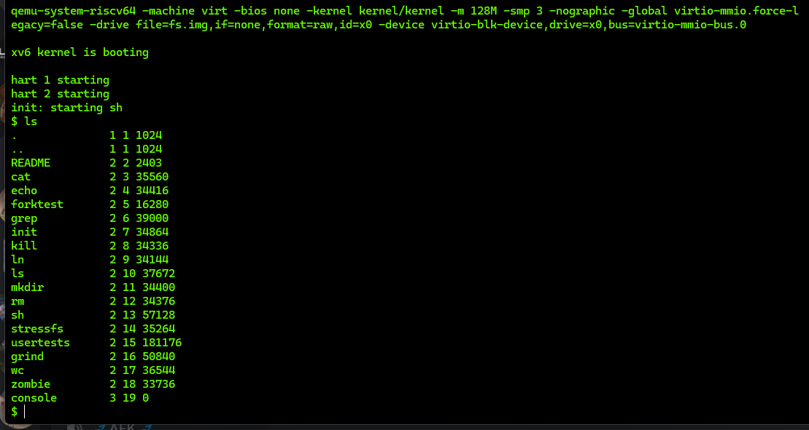
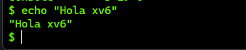
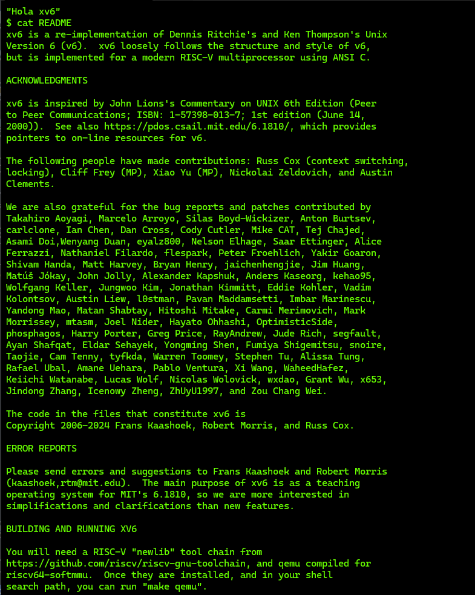

# Tarea 0

## Pasos seguidos para instalar xv6 

1- Hacer fork al repositorio xv6-riscv entregado por el profesor.
2- Crear la rama tarea-0.

3- Hacer checkout para trabajar con esta rama.
4- Instalar Toolchain junto a todas las dependencias necesarias como QEMU.
5- Usar los comandos "make" y luego "make qemu" para ejecutar xv6.

## Problemas encontrados y soluciones

1- En un principio se uso la versión de Ubuntu 24.04 pero la documentacion o la informacion existente sobre Toolchain era en versiones inferiores por lo que se utilizo la versión de Ubuntu 20.04 ya que en esa version fue testeada la guia de toolchain entregada por el profesor.
2- No se logro instalar la opcion de Toolchain entregada por el profesor de manera exitosa, dando errores a los cuales no se les pudo dar origen para encontrar una solución, por lo que se opto por otro metodo para instalar Toolchain con exito
3- El principal error encontrado es que el xv6 entregado es muy sensible a la versión de QEMU, por lo que no se logro emular xv6 correctamente hasta lograr QEMU en la version 7.2.0.

##  Confirmación de que xv6 está funcionando correctamente

