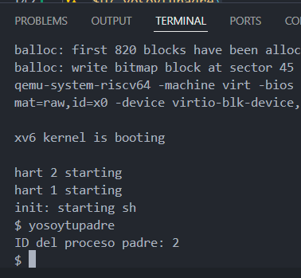

# TAREA-1 PARTE 1
## GETPPID PROCEDIMIENTO
### 1. sysproc.c

En este archivo se crea la lógica de la función ```getppid```
la cual devuelve el Id del proceso padre del proceso actual.
```c
uint64
sys_getppid(void)
{
  return  myproc()->parent->pid;
}
```
### 2. syscall.c
Aquí se establece el manejo para la llamada de sistema para la función ```getppid``` donde en primer lugar llamamos a la función que creamos y luego la agregamos a la lista de las llamadas al sistema.

```c
extern uint64 sys_getppid(void);

static uint64 (*syscalls[])(void) = {
  ...
  [SYS_getppid] sys_getppid,
  ...
};
```
### 3. syscall.h
Aquí se define el número asociado a cada llamada de sistema para su identificación cada vez que se llame la función ```getppid```.
```c
#define SYS_getppid 22 
```
### 4. user.h
Aquí se define la función para poder ser llamada por el usuario.
```c
int getppid(void);
```
### 5. usys.pl
Este es un script que forma parte del proceso que facilita que el usuario haga llamadas de sistema definidas en el kernel.
```c
entry("getppid");
```
### 6. yosoytupadre.c
Este es el programa del usuario en donde llamaremos a la función ```getppid```.
```c
#include "user/user.h"
#include "kernel/stat.h"
#include "kernel/types.h"

int main(void) {
  int ppid = getppid();
  fprintf(2, "ID del proceso padre: %d\n", ppid);
  
  exit(0);
}
  
```
### 7. Makefile
Aquí se agrega el programa ```yosoytupadre.c``` para poder ser utilizado dentro del sistema operativo.

```c
UPROGS=\
    ...
    $U/_yosoytupadre\
    ...

```

### 8. Funcionamiento




# TAREA-1 PARTE 2

## GETANCESTOR
Se repite el procedimiento anterior, pero ahora con la llamada de sistema de ```getancestor```.
### 1. sysproc.c
```c
uint64
sys_getancestor(void)
{
  int n;
  struct proc *p = myproc();
  
  // Obtener el parámetro n de la syscall
  argint(0, &n);
  
  // Validar el parámetro n
  if (n < 0)
    return -1;

  // Recorrer la cadena de ancestros
  for(int i = 0; i < n; i++) {
    if(p->parent == 0) // Si no hay más ancestros
      return -1;
    p = p->parent;
  }
  
  return p->pid;
}
```
### 2. syscall.c

```c
extern uint64 sys_getancestor(void);

static uint64 (*syscalls[])(void) = {
  ...
  [SYS_getancestor] sys_getancestor,
  ...
};

```
### 3. syscall.h
```c
#define SYS_getancestor 23

```

### 4. user.h
A diferencia del caso anterior, aquí se usa ```int``` en vez de ```void``` ya que esta llama de sistema recibe un valor de número entero.
```c
int getancestor(int);

```
### 5. usys.pl
```c
entry("getancestor");
```
### 6. getancestor.c
El programa en primer lugar verifica que se ejecute correctamente, luego hace la llamada al sistema ```getancestor``` con el valor entregado, devolviendo el id del proceso o el texto "No hay tantos ancestros" en el caso de que devuelva el valor -1.
```c
#include "kernel/types.h"
#include "kernel/stat.h"
#include "user/user.h"

int main(int argc, char *argv[]) {
  if (argc != 2) {
    fprintf(2, "Usage: getancestor <n>\n");
    exit(1);
  }

  int n = atoi(argv[1]); // Convertir el argumento de la línea de comandos a un entero
  int ancestor_pid = getancestor(n);

  if (ancestor_pid == -1) {
    printf("No hay tantos ancestros\n");
  } else {
    printf("El ancestro %d tiene PID %d\n", n, ancestor_pid);
  }

  exit(0);
}
```
### 7. Makefile

```c
```c
UPROGS=\
    ...
    $U/_getancestor\
    ...

```

### 8. Funcionamiento
Para ```getancestor```  1 y 2 siempre entregará los mismos valores, ```getancestor 1``` -> PID 2 que seria el proceso que se crea la shell del programa y ```getancestor 2``` -> PID 1 que es el init del sistema, y para valores mayores no existen ancestros. y luego ```getancestor 0``` -> PID actual; por ejemplo en la imagen entrega el valor 9, ya que se hicieron pruebas previas, pero después de probar los valores 1, 2, 3 y 4, se hace nuevamente ```getancestor 0``` y entrega el valor 14.


# DIFICULTADES ENCONTRADAS
La principal dificultad encontrada fue entender el mecanismo y cómo funciona el sistema operativo, ya que presenta un formato bastante estricto y sensible al mínimo cambio, pero una vez entendiendo el funcionamiento, se vuelve mucho más sencillo el procedimiento. Por ejemplo, para incorporar la llamada  ```getancestor``` fue un procedimiento bastante más rápido que ```getppid``` ya que se tenía un conocimiento más completo sobre qué archivos modificar y cómo modificar cada uno, ya que en gran parte el procedimiento era el mismo. Por otro lado, para crear la lógica de las funciones ```getppid``` y ```getancestor``` no fue sumamente complicado y se logró implementar de manera sencilla.